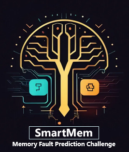

Modified 2024年7月18日14点07分

# Motivation

Uncorrectable Errors (UEs) of Dual Random Access Memory(DRAM) have been
identified as a major failure cause in data centers and the multi-bit UE failure
of High Bandwidth Memory (HBM), which highly threaten the availability and
reliability of the server and the entire computing clusters. Forecasting UEs before
enacting preemptive maintenance measures has emerged as a viable strategy for
diminishing server outages and some machine-learning based solutions have also
been proposed. However, the UEs prediction presents several challenges: data
noise and extremely imbalance as the UEs are exceedingly rare in memory events;
heterogeneous data sources as the DRAMs in the field come from different manu-
facturing or architecture platforms; distribution shifts due to the hardware aging;
and latent factors due to the dynamic access mechanism. We cure a real-world
memory error dataset that contains both micro and bit information and present a
two-stage challenge for more efficient and generalized event prediction solution.
We believe the competition will provide a breeding ground to foster discussions
and further progress on several important research topics towards real-world ML
applications.

# Targets

Our competition will furnish participants with a dataset comprising memory system
configurations, memory error logs, and failure tags to devise solutions for predicting potential failures
of individual DRAM modules within a subsequent observation period. The competition comprises
two stages: the initial stage features an AB List setup, which includes training data tailored for two
diverse memory models. Subsequently, in the second stage, a fresh dataset encompassing mixed
models (more than two) will be introduced to encourage solutions with few-shot learning capabilities
and knowledge transfer ability. Overall, the competition’s appeal lies in its practical relevance, the
accessible entry point of the initial stage, and the fresh challenges presented in both stages. 

# Impact

Infrastructure Reliability is important to both industry and society in the era of artificial intelligence
and Industry 4.0. However, intelligent hardware failure prediction is still barely satisfactory in many
real-world due to the complexity of the problem, lack of publically available large-scale datasets,
well-defined tasks, and evaluation procedures. In this competition, we will provide a period of
memory system logs, memory failure address data, and failure tags for the contestants to propose their
solutions to predict whether each Dram will occur UE. As a failure prediction task from real-world
scenarios with large, complex, and inflexible present explicit information, this competition will
increase the access and usability of solving the infrastructure operation of both manufacturing and
ICT. In addition, the new competition will kick-start the development of novel feature extraction,
spatial-temporal pattern mining, and representation learning techniques for event prediction. Novel
methods and ideas proposed for this competition will also be transferable to similar tasks in which a
set of declarative specifications needs to be precisely extracted from given technical descriptions. We
believe the competition will provide a breeding ground to foster discussions and further research on
several important research topics towards real-world ML applications, such as distribution shifts, data
imbalance, table representation learning, causal representation learning and etc. 

# Sponsors

