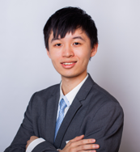
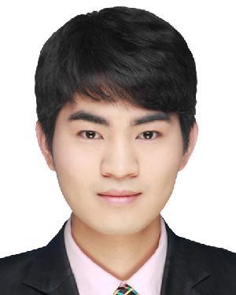
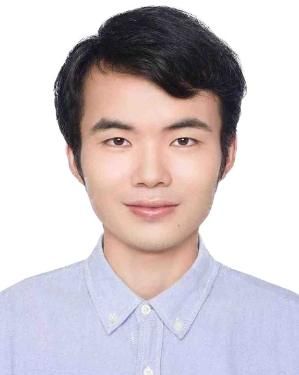

# Organizers

<!-- * Zhenli Sheng
* Min Zhou
* Qiao Yu
* Jialiang Yu
* Wengui Zhang
* Jorge Cardoso
* Xuetong Hao
* JieWang -->

<table cellspacing="0" cellpadding="0" style="border-collapse: collapse;">
    <tr>
        <td style="text-align: center; border: none;">
        <figure><figcaption>Min Zhou, Huawei Cloud Computing Co.Ltd</figcaption></figure></td>
        <td style="text-align: center; border: none;"><figure><figcaption>Qiao Yu, Technical University of Berlin</figcaption></figure></td>
        <td style="text-align: center; border: none;"><figure><figcaption>Jialiang Yu, Huawei Cloud Computing Co.Ltd</figcaption></figure></td>
    </tr> 
    <tr>
        <td style="text-align: center; border: none;">
        <figure><figcaption>Wengui Zhang, Huawei 2012 Lab</figcaption></figure></td>
        <td style="text-align: center; border: none;"><figure><figcaption>Zhenli Sheng, Huawei Cloud Computing Co.Ltd</figcaption></figure></td>
        <td style="text-align: center; border: none;"><figure><figcaption>Jorge Cardoso, Huawei Munich Research Center</figcaption></figure></td>
    </tr>
</table>
